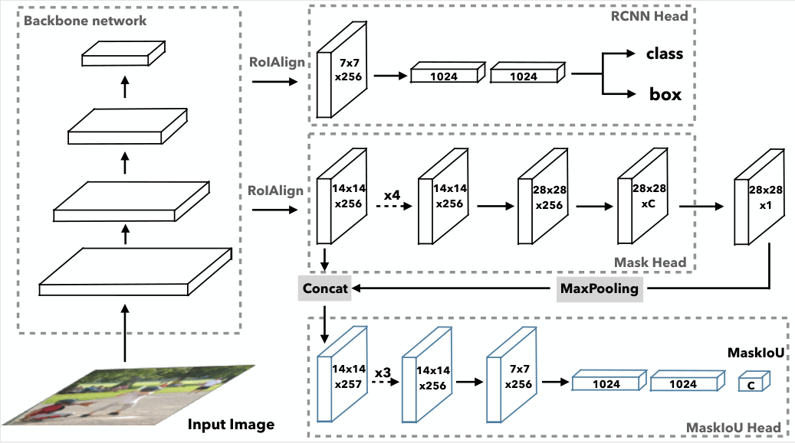
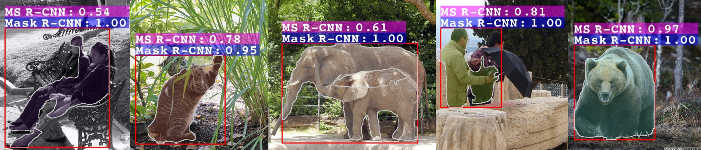

Mask Scoring R-CNN (MS R-CNN)
-----------------
By [Zhaojin Huang](https://github.com/zjhuang22), [Lichao Huang](https://scholar.google.com/citations?user=F2e_jZMAAAAJ&hl=en), [Yongchao Gong](https://dblp.org/pers/hd/g/Gong:Yongchao), [Chang Huang](https://scholar.google.com/citations?user=IyyEKyIAAAAJ&hl=zh-CN), [Xinggang Wang](http://www.xinggangw.info/index.htm).

CVPR 2019 Oral Paper, [pdf](http://openaccess.thecvf.com/content_CVPR_2019/papers/Huang_Mask_Scoring_R-CNN_CVPR_2019_paper.pdf)

This project is based on [maskrcnn-benchmark](https://github.com/facebookresearch/maskrcnn-benchmark).

Introduction
-----------------
[Mask Scoring R-CNN](https://arxiv.org/pdf/1903.00241.pdf) contains a network block to learn the quality of the predicted instance masks. The proposed network block takes the instance feature and the corresponding predicted mask together to regress the mask IoU. The mask scoring strategy calibrates the misalignment between mask quality and mask score, and improves instance segmentation performance by prioritizing more accurate mask predictions during COCO AP evaluation. By extensive evaluations on the COCO dataset, Mask Scoring R-CNN brings consistent and noticeable gain with different models and different frameworks. The network of MS R-CNN is as follows:




Install
-----------------
  Check [INSTALL.md](INSTALL.md) for installation instructions.


Prepare Data
----------------
```
  mkdir -p datasets/coco
  ln -s /path_to_coco_dataset/annotations datasets/coco/annotations
  ln -s /path_to_coco_dataset/train2014 datasets/coco/train2014
  ln -s /path_to_coco_dataset/test2014 datasets/coco/test2014
  ln -s /path_to_coco_dataset/val2014 datasets/coco/val2014
```


Pretrained Models
---------------
```
  mkdir pretrained_models
  #The pretrained models will be downloaded when running the program.
```
My training log and pre-trained models can be found here [link](https://1drv.ms/f/s!AntfaTaAXHobhkCKfcPPQQfOfFAB) or [link](https://pan.baidu.com/s/192lRQozksu5XwpU9EO5neg)(pw:xm3f).


Running
----------------
Single GPU Training
```
  python tools/train_net.py --config-file "configs/e2e_ms_rcnn_R_50_FPN_1x.yaml" SOLVER.IMS_PER_BATCH 2 SOLVER.BASE_LR 0.0025 SOLVER.MAX_ITER 720000 SOLVER.STEPS "(480000, 640000)" TEST.IMS_PER_BATCH 1
```
Multi-GPU Training
```
  export NGPUS=8
  python -m torch.distributed.launch --nproc_per_node=$NGPUS tools/train_net.py --config-file "configs/e2e_ms_rcnn_R_50_FPN_1x.yaml" 
```


Results
------------
| NetWork  | Method | mAP(mask) | mAP(det)  |
|----------|--------|-----------|-----------|
| ResNet-50 FPN | Mask R-CNN | 34.2 | 37.8 |
| ResNet-50 FPN | MS R-CNN | 35.6 | 37.9 |
| ResNet-101 FPN | Mask R-CNN | 36.1 | 40.1 |
| ResNet-101 FPN | MS R-CNN | 37.4 | 40.1 |


Visualization
-------------

The left four images show good detection results with high classification scores but low mask quality. Our method aims at solving this problem. The rightmost image shows the case of a good mask with a high classification score. Our method will retrain the high score. As can be seen, scores predicted by our model can better interpret the actual mask quality.

Acknowledgment
-------------
The work was done during an internship at [Horizon Robotics](http://en.horizon.ai/).

Citations
---------------
If you find MS R-CNN useful in your research, please consider citing:
```
@inproceedings{huang2019msrcnn,
    author = {Zhaojin Huang and Lichao Huang and Yongchao Gong and Chang Huang and Xinggang Wang},
    title = {{Mask Scoring R-CNN}},
    booktitle = {CVPR},
    year = {2019},
}   
```

License
---------------
maskscoring_rcnn is released under the MIT license. See [LICENSE](LICENSE) for additional details.

Thanks to the Third Party Libs
---------------  
[maskrcnn-benchmark](https://github.com/facebookresearch/maskrcnn-benchmark)   
[Pytorch](https://github.com/pytorch/pytorch)   
